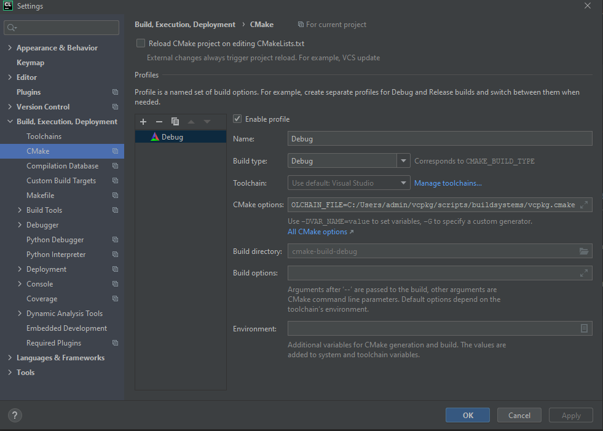

# HW0 - Getting Started

## Part 0 - Setup vcpkg - Windows

Vcpkg là một hệ quản trị các package C++ được tạo ra bởi Microsoft. Vào năm 2016, giúp đơn giản hóa việc quản lý thư viện C++ dễ dàng hơn nhiều lần

```bash
git clone https://github.com/microsoft/vcpkg
.\vcpkg\bootstrap-vcpkg.bat
```

sau đó các bạn có thể cài các thư viện cần thiết cho chương trình bằng cú pháp

```bash
.\vcpkg\vcpkg install [packages to install]
```
vd cho hw_0:

```bash
.\vcpkg\vcpkg install freetype 
.\vcpkg\vcpkg install opengl 
```
`--triplet=x64-windows` có thể được thêm vào để build trên nền x64

bạn có thể tim 1 package như sau:

``` bash
.\vcpkg\vcpkg search package
```

## Part 1 - Setting up your machine and running the project
### CLion (Windows / MacOS / Linux)

Trong môn học này, mình khuyến nghị mọi người sử dụng Clion, 1 IDE giúp dễ dàng lập trình C++, để có thể sử dụng C++, bạn có thể cài đặt từ trang chủ Jetbrain
[tại đây](https://www.jetbrains.com/clion/).

Để build được trên windows, bạn phải cài visual Studio tool chain C++ theo hướng dẫn [tại đây](https://www.jetbrains.com/help/clion/quick-tutorial-on-configuring-clion-on-windows.html#MSVC)

Các thư viện trong vcpkg k thể tự link đến chương trình của bạn được, bạn phải cài đặt bằng cách thêm flag 
```
-DCMAKE_TOOLCHAIN_FILE=[vcpkg root]/scripts/buildsystems/vcpkg.cmake
```
Trong Clion vào File > Settings ở Windows và Linux, CLion > Preferences ở macOS)-> CMake settings (Build, Execution, Deployment > CMake). Trong CMake options


Lúc này, bạn có thể reload lại cmake, nếu không có lỗi gì chứng tỏ phần cài đặt đã thành công

### Linux
Bạn có thể build chương trình bằng cmake trên terminal của ubuntu, chạy các câu lệnh sau để cài các thư viện cần thiết
```
sudo apt update
sudo apt install -y build-essential cmake xorg-dev libfreetype6-dev
sudo apt install -y mesa-common-dev libgl1-mesa-dev libglu1-mesa-dev 
```
để build chương trình, các bạn có thể chạy câu lệnh sau

```
mkdir build
cd build
cmake ..
make
```

sau đó bạn có thể chạy chương trình bằng cú pháp 
```
./quad_test
```
### Common issue: Chỉ thấy hình chữ nhật màu vàng

Nếu bạn thấy hình chữ nhật màu vàng thì chứng tỏ chương trình của bạn đã thành công, tuy nhiên bạn không thấy hình bức tường là do working directory của bạn chưa đúng, hay set working directory của bạn đến thư mục project.

## Part 2 - Basic C++/Linear Algebra Practice

hãy hoàn thành hàm ```mult``` ở phần đầu của file ```quad_test.cpp``` bằng cách cài đặt 1 phép nhân ma trận `3x3`. không được sử dụng hàm CGL multiplication có sẵn, bạn có thể xem [CGL vectors documentations](https://cs184.eecs.berkeley.edu/sp21/docs/cgl-vector-docs) để có thể hiểu hơn cách dùng các params của hàm. Một khi được cài đặt thành công, bạn có thể thấy viên gạch vàng xoay 90 độ.

cố gắng hoàn thành bài tập này mà __không cần__ tính từng __component__ của vector. (Hint: một phép nhân ma trận 3d là tổng của 3 phép nhân scalar-vector (dot product), bạn có thể dùng cột của ma trận như là vector)

nhớ build lại chương trình để tháy kết quả.

Nếu cảm thấy bài tập quá dễ, bạn có thể cài đặt phép scaling (có thể) hoặc shifting operation (tại sao không thể?). chúng ta sẽ học phần này ở các bài sau này.

## Part 3 - Types of Filters

có 1 vài TODO comments trong code - một ở hàm ```glTexParameteri``` , và 1 ở hàm ```glTexCoord2f```. đây là 2 API gọi đến thư viện ```OpenGL```, hàm đầu tiên gọi tới texture processing, hàm tiếp theo gọi tới mapping 1 texture coordinate. 

```OpenGL``` không bắt buộc phải học trong môn này. nếu hình vẽ ra quá khó nhìn, chúng ta có thể 'zoom in' bằng cách set value nhỏ cho ```glTexCoord2f```.

2 loại filter `Linear` và `Nearest` khác nhau ở đâu? nếu add `MipMap` options thì kết quả sẽ như thế nào?  Các hàm này được cài như thế nào? 

Optional: để kỹ hơn về các dạng filtering, có thể tham khảo ở [click here](https://learnopengl.com/Getting-started/Textures).

## Part 4 - Going Above and Beyond (Optional)

Trong đồ họa máy tính, hầu hết mọi thứ đều được tạo ra từ các hình tam giác hoặc tứ giác. Hình dạng và đối tượng được biểu diễn dưới dạng [lưới bao gồm hàng trăm hoặc thậm chí hàng nghìn hình tam giác] (https://en.wikipedia.org/wiki/Triangle_mesh). Hãy thử và làm điều gì đó thú vị hơn với những hình tam giác của chúng ta.

Hãy xem hàm ``render`` trong ``quad_test.cpp``. Lưu ý các lệnh sau:
* ```glColor3f(1.0, 1.0, 0.0)``` yêu cầu máy tính của chúng ta hiển thị các hình dạng với giá trị màu RGB (1.0, 1.0, 0.0) hoặc màu vàng..
* ```glBegin(GL_QUADS)``` cho máy tính của chúng ta biết rằng chúng ta muốn hiển thị các hình chữ nhật với các đỉnh sau đây mà chúng ta sẽ chỉ định.
* ```glVertex3f(x, y, z)``` yêu cầu máy tính của chúng ta vẽ một đỉnh tại một vị trí cụ thể.

Với thiết lập trên, nếu chúng ta vẽ tám đỉnh, máy tính của chúng ta sẽ hiển thị một hình tứ giác với bốn đỉnh đầu tiên và một hình tứ giác khác với bốn đỉnh thứ hai (Người ta có thể làm tương tự đối với hình tam giác với `` glBegin (GL_TRIANGLES) `` , sử dụng ba đỉnh trên mỗi tam giác). Hãy thử sửa đổi code đã cho để vẽ "thứ gì đó thú vị". (Lưu ý: Nếu bạn muốn tắt kết cấu, bạn sẽ cần phải chú thích dòng `` glBindTexture (GL_TEXTURE_2D, texture) '' ở đầu hàm `` render '').

## Submission
Nộp bài của bạn ở trên course vnu cho assignment 0
